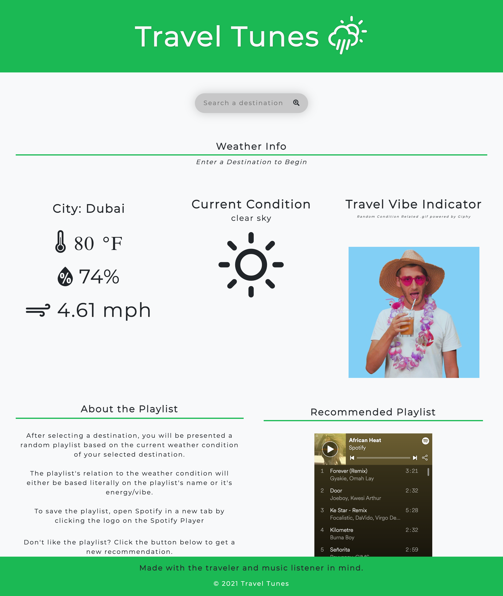

# Travel Tunes

# Description:
We have made an app which will generate a playlist based on the weather & location of the destination which you are traveling. 
Motivation for development?

We have all been traveling at some point and realized we did not have a playlist prepared for our lengthy flight or drive. This app takes care of the forgetful travelers problem by providing us with a generated music playlist based off of where we are headed. 

# User story:
As a user/traveler I would like an app that would tell me the weather forecast of my destination and provide me with weather/mood related music to listen to on my journey, as well as a visual representation of the weather.

# Functionality and Features:
A user will enter a city location. They will be presented with the current weather conditions including temperature, humidity, windspeed, a description of the weather (example: "moderate rain"), and a random weather related .gif based on the weather condition. The user will then be presented with an embeded spotify player chosen at random, from a limited pre-curated weather related list. The User will then have the option to get a new playlist with the click of a button. If the user wishes to save the playlist they can click the spotify logo to be directed to the playlist on the Spotify website in a new tab. The Travel Tunes website will automatically load the most recent search. 

# Technologies:

This app runs in the browser and features dynamically updated HTML5, CSS powered by pureCSS, and JavaScript.

- HTML5
- CSS: pureCSS framework + custom css styling
- JavaScript
- Weather Icons font by Erik Flowers https://erikflowers.github.io/weather-icons/

# 2 server-side APIs

- OpenWeather API
- Giphy API

# Links: 

Github Repo: https://github.com/RotichD/travel-music
Travel Tunes: https://rotichd.github.io/travel-music/

