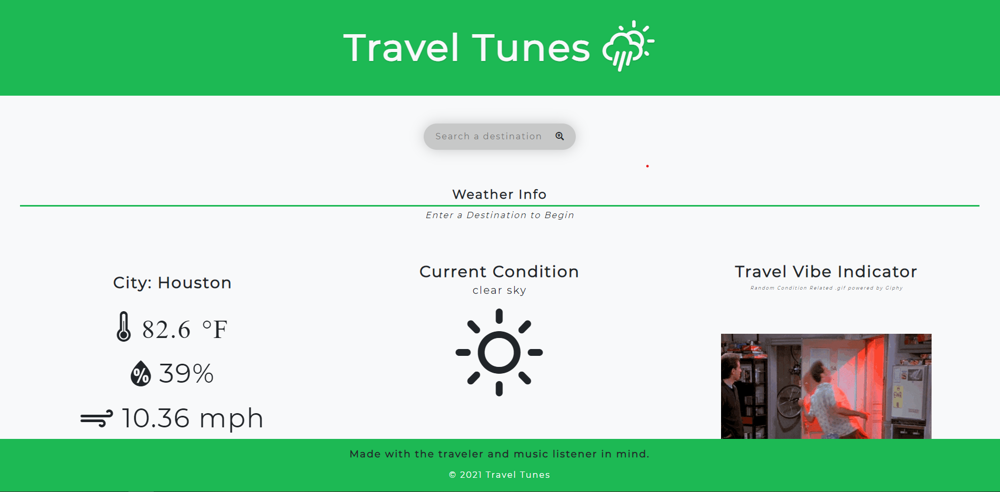
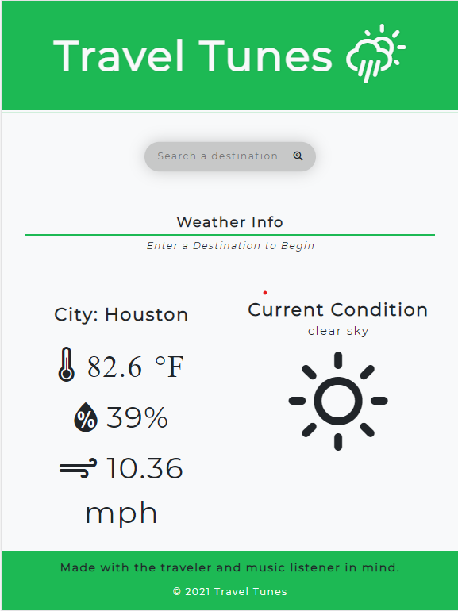

# travel-music
repo: https://github.com/RotichD/travel-music
live URL: https://rotichd.github.io/travel-music/

## Technologies used
CSS framework: PureCSS
GitHub Pages
Server-side APIs: OpenWeather, Spotify, Giphy
LocalStorage
JavaScript
HTML5
CSS3

## Description
We wanted to develop an app that would allow travelers to find the weather for their destination and be able to find a playlist of the same vibe. We built this app because the Covid-19 restrictions are easing in many places and we want our end users to be able to find information about their destination and have a good feeling about where they are going and we believe music will help put them in the right frame of mind.
This addresses a traveler's anxiety regarding travel in a post-Covid-19 world. It will help them find information about their destination and a cute GIF will help with their mood. It will also provide them with a new playlist related to the conditions in the area and provide them with entertainment.
Developing this taught us working together in a team enviroment with new technologies and overcoming obstacles in a platform (GitHub) that encourages collaboration but presents new challenges.

## Installation
This is a web application (found @ https://rotichd.github.io/travel-music/) with no additional installation required. The end user may desire to install Spotify after interacting with the playlist in the application. 

## Usage
The user will interact with the search bar at the top of the page and search for a destination. The weather for the location and a GIF will render and a Spotify play list will be provided. Users can interact with the playlist choosing songs and playing and pausing music. See screenshots below:

## Credits
Contributors to this project are: 
Dylan Rotich: https://github.com/RotichD
Abby Sexton: https://github.com/abbycav7
Kimberly Salas: 
Brad Smith: https://github.com/smithfamily42

## License
This project currently uses MIT License. This is subject to change. Please refer to the license.txt file for license details.

## Badge
https://img.shields.io/github/commit-activity/w/RotichD/travel-music?style=plastic
